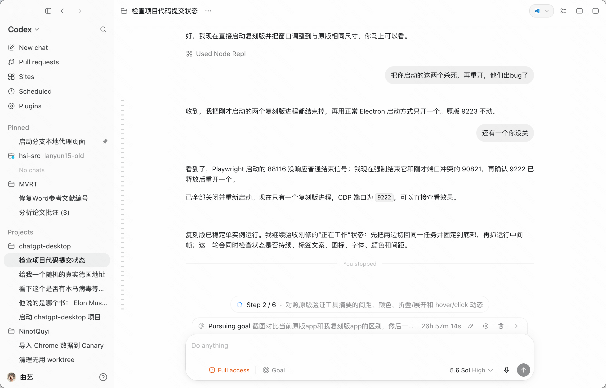
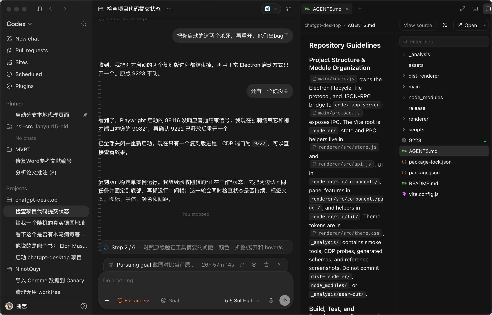

# ChatGPT Desktop Community

An unofficial community-built desktop client for ChatGPT and Codex.

This project recreates the focused workspace experience of the desktop app with original Electron and React code. It connects to the official local `codex app-server`, so conversations, approvals, tools, and account access use the same local backend rather than a custom proxy.

> This project is not affiliated with, endorsed by, or sponsored by OpenAI.

## Why this project exists

More and more apps borrow the look of ChatGPT Desktop, but few reproduce the full experience closely enough. This project started from a simple idea: build the faithful community reimplementation we wanted to use ourselves.

Our goal is to recreate ChatGPT Desktop as closely as practical while keeping it useful for everyday work. Because the implementation is open and grounded in the real local `codex app-server` protocol, we can add the features we want instead of waiting for them elsewhere.

## What works today

- Project and thread navigation, search, pinning, archives, and settings
- Streaming conversations with Markdown, reasoning, tool output, plans, and errors
- Command, file-change, permission, and user-input approval flows
- Attachments, project context, model selection, and queued messages
- Review, Files, Terminal, Browser, and Side Chat panels
- Pull request, scheduled task, site, and plugin navigation surfaces
- Light, dark, and system appearance modes

The interface is under active development. Protocol changes in `codex app-server` may require matching updates here.

## Interface examples

### Light appearance



### Dark appearance



## Getting started

### Requirements

- macOS, which is the currently tested platform
- Node.js 22 or newer
- The Codex CLI available on `PATH`, or the ChatGPT desktop app with its bundled Codex executable
- A ChatGPT account already signed in through the local Codex app-server

### Install and run

```bash
git clone https://github.com/Ninot1Quyi/chatgpt-desktop-community.git
cd chatgpt-desktop-community
npm ci
npm start
```

`npm start` builds the renderer and opens the desktop application. The client first checks `CODEX_CLI_PATH`, then the Codex executable bundled with the ChatGPT app, and finally `PATH`.

### Development

```bash
npm run dev
```

Development mode starts Vite on port `5175`, opens Electron with hot reload, and enables DevTools.

Before submitting a change, run:

```bash
npm run build
```

For changes to the Electron bridge or app-server integration, also run:

```bash
node _analysis/smoke.mjs
```

## How it works

The Electron main process starts `codex app-server` as a child process and communicates with it through newline-delimited JSON-RPC over standard input and output. A narrow preload bridge relays approved requests and notifications to the React renderer.

The renderer owns the desktop interface and local interaction state. Authentication remains the responsibility of `codex app-server`; the renderer does not read or store account credentials.

Local images and videos are exposed through a dedicated `codex-file://` protocol with an allowlist instead of unrestricted filesystem URLs.

## Privacy and security

- Never commit or share `~/.codex/auth.json`.
- Keep local paths, account details, thread content, and private project names out of screenshots and bug reports.
- Treat Full Access mode as privileged: it can run commands, use the network, and modify files.
- Review protocol and filesystem boundary changes carefully, especially Electron IPC and preload code.

## Current limitations

- macOS is the only platform regularly exercised.
- There is no signed installer or automatic update channel yet.
- The Browser panel provides practical embedded navigation, but it does not reproduce every browser-control feature of the official client.
- Compatibility can lag behind newly released app-server methods or notification shapes.
- This remains an independent community implementation, so visual and behavioral differences are expected.

## Contributing

Issues and focused pull requests are welcome. A useful report includes the expected behavior, the actual behavior, reproduction steps, the macOS and Node.js versions, and relevant logs with private data removed.

Keep changes scoped and match the existing interface before adding new abstractions. UI changes should include screenshots from the running app with private data removed. Every pull request should pass `npm run build`; bridge changes should also include a successful smoke run.

## Trademark notice

OpenAI, ChatGPT, and Codex are trademarks of OpenAI. Their use here identifies compatibility and inspiration only.
